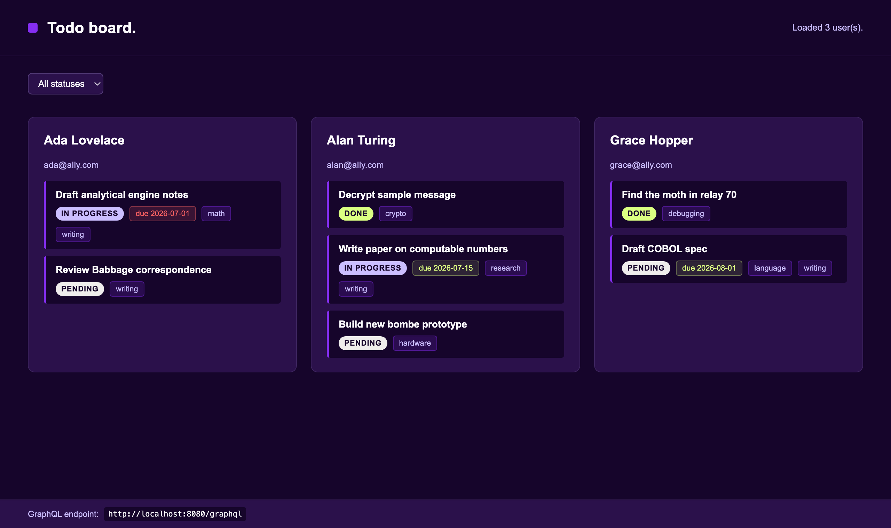

# NOTES

## The UI



Each user gets a column with their tasks. Every task shows its status, its tags,
and its due date. Overdue tasks are highlighted in red (see Ada's first task).
The dropdown at the top filters tasks by status, and the GraphQL endpoint is
shown in the footer.

## 1. The bug

Running `go run ./cmd/seed` failed with this error:

```
syntax error at or near "\" (SQLSTATE 42601)
```

The users were inserted fine, so the problem was in the query that inserts
tasks. That one query used backticks around the column names (MySQL style),
which Postgres does not accept. It was easy to miss because backticks appear all
over the file for a normal reason — Go uses them to write multi-line strings.

**Fix:** rewrite that one query the same way as the others (a normal Go
multi-line string, no backticks around column names). Re-running seed was
already safe because it clears the tables first.

## 2. Library and project layout

I used `graphql-go/graphql`. It lets me define the schema directly in Go with no
code generation and no extra tooling — a good fit for a schema this size.

The code is split into three parts:

- `internal/store` — all the database code (SQL queries and the data types)
- `internal/gql` — the GraphQL schema, the resolvers, and the HTTP handler
- `cmd/server` — starts everything up

A few things worth pointing out:

- All tags are loaded in **one** query instead of one query per task.
- Asking for a user that doesn't exist returns `null`; trying to create a task
  for a user that doesn't exist returns a clear error. Bad input is rejected
  before it ever reaches the database.
- All four "nice to have" items are done: JSON logs, per-resolver timing
  (turn on with `LOG_LEVEL=debug`), a Dockerfile with an extended
  docker-compose, and tests for the database layer.

## 3. The field I added

I added **`dueDate`**. I picked it because it can be empty, which is a good test:
it proves an empty value travels correctly from the database, through the API,
and into the UI (the due-date chip only appears when a task actually has a date).

I also added two small extras: filtering tasks by status, and highlighting
overdue tasks in red.

## 4. Things I left out (and why)

- Loading each task's user still runs one query per task. A "dataloader" would
  batch these, but it wasn't needed at this scale.
- `dueDate` is sent as plain text rather than a dedicated date type.
- Tests cover the database layer only.
- There's no delete-task mutation.

## 5. How to run it

**Recommended — everything in Docker.** This starts the database, waits for it
to be ready, seeds it, then starts the API. Nothing to install but Docker:

```bash
docker compose up --build          # Postgres → seed → API on :8080
```

**Or run the app locally** (needs Go installed). The important part is the
`--wait` flag: it makes the command block until Postgres is actually ready to
accept connections. Without it, the next command can run too early and fail with
"connection refused":

```bash
docker compose up -d --wait postgres   # start the database AND wait until it's ready
go run ./cmd/seed                      # load sample data
go run ./cmd/server                    # start the API
```

Then open http://localhost:8080/ for the UI. GraphQL is at `/graphql` and a
health check is at `/healthz`.

## 6. How to test it

### Automated tests

The tests live in `internal/store/store_test.go` and run against a live Postgres.
Make sure the database is up and seeded first, then run them:

```bash
docker compose up -d --wait postgres   # database must be running
go run ./cmd/seed                       # and seeded
go test ./...                           # run the tests
```

If Postgres isn't reachable the tests **skip themselves** instead of failing, so
`go test ./...` is always safe to run. What they cover:

- `TestUsers` — every user comes back with all fields filled in
- `TestUserByID` — looking up a real user works; a missing id returns `ErrNotFound`
- `TestTasksFilterByStatus` — the status filter only returns matching tasks, and
  tags are never null
- `TestCreateAndUpdateTask` — the full write path: create a task, read it back,
  change its status, and confirm duplicate tags are removed (the test cleans up
  after itself, so it doesn't leave rows behind)

### Testing the API in Postman

With the app running, set up one request in Postman and reuse it for everything:

- **Method:** `POST`
- **URL:** `http://localhost:8080/graphql`
- **Headers:** `Content-Type: application/json`
- **Body:** choose **raw** and **JSON**, then paste one of the samples below.

(GraphQL always uses POST with a JSON body — the query goes inside a `"query"`
field.)

**List users and their tasks**

```json
{ "query": "{ users { name tasks { title status dueDate tags } } }" }
```

**Filter tasks by status** (values: `PENDING`, `IN_PROGRESS`, `DONE`)

```json
{ "query": "{ tasks(status: DONE) { title status } }" }
```

**Get one task with its owner and tags**

```json
{ "query": "{ task(id: \"1\") { title dueDate tags user { name } } }" }
```

**Create a task**

```json
{ "query": "mutation { createTask(userId: \"1\", title: \"New task\", dueDate: \"2026-09-01\", tags: [\"demo\"]) { id title status dueDate tags } }" }
```

**Update a task's status**

```json
{ "query": "mutation { updateTaskStatus(id: \"1\", status: DONE) { id status } }" }
```

**Error handling** — try an invalid id and you'll get a clear message back while
the server keeps running (a valid-but-missing user just returns `null`):

```json
{ "query": "{ user(id: \"not-a-number\") { name } }" }
```

Note: GraphQL returns HTTP `200` even for these errors — look at the `errors`
field in the response body, not the status code.

I tested all of this with Postman (including the error cases), plus GraphiQL and
DBeaver.

---

I used AI tools while building this. I've reviewed all the code and can walk
through any part of it.

Reviewed by: Ajay Varma
